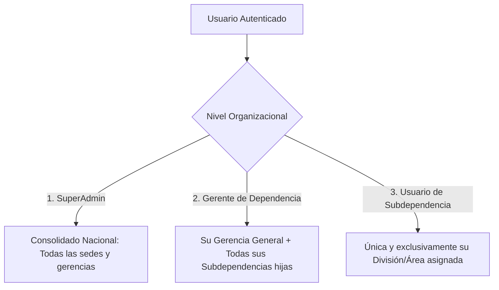

# 📚 Memoria Técnica y Registro de Sesión — SIAC Comensales

**Fecha de Registro:** 26 de Agosto de 2026  
**Proyecto:** SIAC Comensales (Nuxt 3 Fullstack + PostgreSQL + Prisma + Quasar)  
**Servidor de Producción:** Debian 13 (Trixie) — `10.60.0.21:5432`  

---

## 📌 1. Control de Sesión Única de 24 Horas con Desconexión en Vivo

### Regla Arquitectónica:
* **Duración:** 24 horas continuas de sesión (`SESSION_INACTIVITY_TIMEOUT_MINUTES = 1440`).
* **Concurrencia:** 1 solo dispositivo activo por usuario (Política Unificada).
* **Toma de Control:** Si el usuario inicia sesión en una segunda máquina, el sistema detecta la sesión activa (`409 Conflict`) y muestra el diálogo en Quasar:
  > *⚠️ Ya existe una sesión activa en otro equipo. ¿Deseas desconectar la otra sesión e ingresar aquí?*
* **Desconexión en Tiempo Real:** Al confirmar, el servidor emite `session:revoked` a través de WebSockets (`Socket.io`) y el navegador anterior se expulsa automáticamente al login sin recargar.

### Archivos Clave:
* [`server/domain/auth.ts`](file:///C:/siac/comensales/server/domain/auth.ts) — Funciones puras de dominio.
* [`server/services/authService.ts`](file:///C:/siac/comensales/server/services/authService.ts) — Orquestación de login/logout y generación de UUID `sessionId`.
* [`server/utils/auth.ts`](file:///C:/siac/comensales/server/utils/auth.ts) — Validación centralizada en `requireAuth`.
* [`app/plugins/socket.client.ts`](file:///C:/siac/comensales/app/plugins/socket.client.ts) — Receptor en tiempo real del evento de revocación.
* [`nuxt.config.ts`](file:///C:/siac/comensales/nuxt.config.ts) — Rate limiter ajustado a 15 intentos/min.

---

## 📌 2. Métricas del Dashboard con Aislamiento Jerárquico (3 Niveles)

El panel de inicio (`/`) calcula estadísticas operativas en tiempo real en microsegundos mediante `Promise.all` y `prisma.count`:



### Componentes:
* **Dominio:** [`server/domain/dashboard.ts`](file:///C:/siac/comensales/server/domain/dashboard.ts)
* **Repositorio:** [`server/repository/dashboardRepository.ts`](file:///C:/siac/comensales/server/repository/dashboardRepository.ts)
* **Servicio:** [`server/services/dashboardService.ts`](file:///C:/siac/comensales/server/services/dashboardService.ts)
* **API:** [`server/api/dashboard/metrics.get.ts`](file:///C:/siac/comensales/server/api/dashboard/metrics.get.ts)
* **UI:** [`app/pages/index.vue`](file:///C:/siac/comensales/app/pages/index.vue) y [`app/composables/features/useDashboard.ts`](file:///C:/siac/comensales/app/composables/features/useDashboard.ts)

---

## 📌 3. Despliegue, Compilación y Corrección de Node 24 (Linux ESM)

### El Bug del Error 500 en Debian y su Solución:
* **Causa:** En Node.js 24 con módulos nativos ESM (`.output/server/`), subrutas como `dayjs/plugin/utc` sin la extensión `.js` arrojaban `ERR_MODULE_NOT_FOUND`.
* **Solución:** Se corrigieron todas las importaciones con extensión `.js`:
  ```typescript
  import utc from 'dayjs/plugin/utc.js'
  import timezone from 'dayjs/plugin/timezone.js'
  import isBetween from 'dayjs/plugin/isBetween.js'
  import customParseFormat from 'dayjs/plugin/customParseFormat.js'
  ```

### Manuales Creados en `docs/`:
1. 📄 [`docs/Manual_Instalacion_y_Compilacion_Debian.md`](file:///C:/siac/comensales/docs/Manual_Instalacion_y_Compilacion_Debian.md)
2. 📄 [`docs/Manual_Despliegue_Rapido_Ya_Compilado.md`](file:///C:/siac/comensales/docs/Manual_Despliegue_Rapido_Ya_Compilado.md)

---

## 📌 4. Estructura Organizacional: Migración de Comensales

### Script SQL para reubicar comensales:
Se trasladaron los 94 trabajadores de *Maquinaria y Logística* (Gerencia 19, Subdep 6) hacia *DIVISIÓN DE LOGÍSTICA* (Gerencia 14, Subdep 28):

```sql
BEGIN;
UPDATE diners
SET subdependency_id = 28, updated_at = NOW()
WHERE subdependency_id = 6;
COMMIT;
```

> **¿Por qué NO es necesario re-migrar huellas?**  
> Porque en PostgreSQL la tabla `biometric_records` está enlazada al comensal por su `diner_id`. Al cambiar la subdependencia, el `diner_id` no cambia y la huella permanece 100% activa.

---

## 📌 5. Migración Biométrica: Templates Ligeros FMD

### Concepto de Template Ligero:
* **Antiguo:** Imágenes `.bmp` (50 KB c/u ➔ 1 GB de base de datos).
* **Nuevo (FMD Base64):** Coordenadas matemáticas de minucias (~1.4 KB a 2.1 KB c/u ➔ 15 MB para 5.000 trabajadores).
* **Velocidad de Búsqueda 1:N:** 40 milisegundos en la memoria RAM del navegador.

### Match Ejecutado para *Gerencia de Talento Humano*:
* Se conectó a la BD del servidor Debian (`10.60.0.21:5432`).
* Se identificaron 41 trabajadores sin huella.
* Se cruzaron contra los respaldos `t_huellatemp_perfecto.sql` y `t_huellatemp_msb.sql`.
* **Resultado:** **38 huellas encontradas, purificadas de saltos de línea e insertadas exitosamente** (El total del servidor subió a 506 huellas).
* Solo 3 trabajadores requerirán captura manual por lector USB.

---

## 📌 6. Comandos Git Rápidos para Sincronización

```bash
# En Windows (Subir cambios):
git add .
git commit -m "docs: actualizar memoria tecnica y documentacion integral"
git push origin main

# En Servidor Debian (Actualizar producción):
cd /var/www/siac-comensales
git pull origin main
npm run build
pm2 restart siac-app
```
